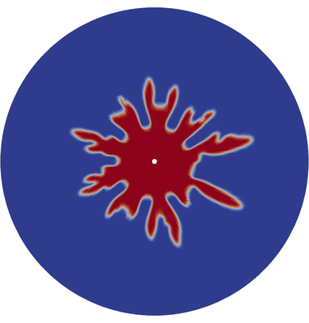

# Hele-Shaw Cells Benchmark

## Problem description

We consider a 2D circular Hele-Shaw cell: two parallel circular plates
separated by a small gap `b`, with an inner disc of radius `R_in` and
an outer disc of radius `R_out`. The cell is filled with a viscous
fluid (here: a "soap" solution), and air is injected at the centre at
a prescribed volumetric flow rate `Q`. The pressure of the injected
air exceeds the hydrostatic pressure in the soap, so the air
displaces the soap in a pattern of viscous fingers. This is the
classic *radial viscous-fingering* problem studied by Saffman, Taylor,
and others.

The flow is modelled in 2D (axisymmetric around the centre, single
cell in the z-direction) using a gap-averaged formulation based on the
power-law viscosity model. The interface between air and soap is
captured by the Volume-of-Fluid method with the `isoAdvector` scheme.

## Mathematical model

The Hele-Shaw cell is, in full three dimensions, a Newtonian
two-phase flow confined between two parallel plates. The
solver `heleShawFoam` solves the un-averaged 3D-in-$z$ system on a
mesh with a single cell in the transverse direction (`NPB = 1`) and a
`gapWidth` parameter; this is the "Hele-Shaw approximation" in
discretized form. The equations below are stated for the full 3D
system; the gap-averaged 2D reduction is given afterwards.

### Governing equations in the gap

We consider an incompressible two-phase flow with a sharp
material interface. Let $\mathbf{u}(\mathbf{x},t)$ be the velocity,
$p(\mathbf{x},t)$ the pressure, $\rho(\alpha)$ and $\mu(\alpha)$ the
density and dynamic viscosity (each a harmonic/arithmetic mixture of
the two phases as defined in `constant/transportProperties`), and
$\alpha(\mathbf{x},t)\in[0,1]$ the volume-of-fluid indicator
($\alpha = 1$ in air, $\alpha = 0$ in soap). The interface is
reconstructed from $\alpha$ by the `isoAdvector` scheme
[@Roenby2016].

Mass conservation (incompressibility):

$$
\nabla \cdot \mathbf{u} = 0.
$$

Momentum balance (Navier--Stokes with a continuum-surface-force
contribution):

$$
\rho \left(\frac{\partial \mathbf{u}}{\partial t} + \mathbf{u}\cdot\nabla\mathbf{u}\right) = -\nabla p + \nabla\cdot(2\mu\,\mathbf{D}) + \mathbf{f}_\sigma,
\qquad
\mathbf{D} = \tfrac{1}{2}\left(\nabla\mathbf{u}+\nabla\mathbf{u}^{\top}\right).
$$

VOF advection (no explicit diffusion in the bulk; interface
compression is added in the discretization):

$$
\frac{\partial \alpha}{\partial t} + \nabla\cdot(\alpha\,\mathbf{u}) = 0.
$$

Continuum surface force (CSF) [@Brackbill1992]:

$$
\mathbf{f}_\sigma = \sigma\,\kappa\,\nabla\alpha,
\qquad
\kappa = \nabla\cdot\!\left(\frac{\nabla\alpha}{|\nabla\alpha|}\right),
$$

where $\sigma$ is the surface tension and $\kappa$ the interface
curvature. The $\nabla\alpha$ factor concentrates the force on the
narrow band of cells that straddle the interface, which is the usual
CSF prescription.

### Gap-averaged 2D model

For Newtonian flow between two parallel plates separated by
$b \ll R$ with no-slip on both plates, the velocity profile across
the gap is parabolic. Averaging over $z\in[-b/2,b/2]$ yields the
*Hele-Shaw equations*

$$
\langle \mathbf{u} \rangle = -\frac{b^2}{12\mu}\,\nabla p,
\qquad
\nabla\cdot\langle\mathbf{u}\rangle
= \left.\frac{Q}{\pi R_\text{in}^2}\right|_{R = R_\text{in}},
$$

i.e. a Darcy-type law in the plane of the cell, with the inlet
flow rate $Q$ prescribed as a uniform source on the disc
$R = R_\text{in}$. The `heleShawFoam` solver does not perform this
analytical averaging; instead it solves the full Navier--Stokes
system on a single-cell-in-$z$ mesh and uses a `gapWidth` parameter
to scale the viscous term accordingly. Up to discretization error,
the two formulations are equivalent on this mesh.

### Initial and boundary conditions

The geometry uses the parameters $R_\text{in}$, $R_\text(out)$,
$b$ and the inlet flow rate $Q$.

$$
\begin{aligned}
\alpha(\mathbf{x},0) &=
\begin{cases}
1, & \sqrt{x^2+y^2} < r_0 \ \text{and}\ |z| < z_0, \\
0, & \text{otherwise},
\end{cases}
&& \text{initial air bubble, } r_0 = 2.5\,\text{mm},\ z_0 = 1.2\,\text{mm},\\[4pt]
\mathbf{u}(\mathbf{x},0) &= \mathbf{0},
&& \text{quiescent soap},\\[4pt]
\int_{R=R_\text{in}} \mathbf{u}\cdot\mathbf{n}\,\mathrm{d}s &= Q,
&& \text{`inlet` (mass-flow inlet)},\\[4pt]
p &= p_\text{ref},\quad \mathbf{u}\cdot\mathbf{n} \le 0 \implies \mathbf{u}\cdot\mathbf{n} = 0
&& \text{`outlet` at } R = R_\text{out},\\[4pt]
\mathbf{u} &= \mathbf{0}
&& \text{`plates` at } z = \pm b/2.
\end{aligned}
$$

The inlet/outlet conditions are imposed by the OpenFOAM
`flowRateInletVelocity` and `inletOutlet` boundary types, and the
plate no-slip is a `fixedValue` $\mathbf{u} = \mathbf{0}$.

### Dimensionless numbers

For the reference configuration
($Q = 4\times 10^{-7}\,\text{m}^3/\text{s}$,
$R_\text{in} = 1.5\,\text{mm}$,
$b = 1\,\text{mm}$,
$\mu_\text{soap} = 2\times 10^{-3}\,\text{Pa}\cdot\text{s}$,
$\mu_\text{air} = 1.5\times 10^{-5}\,\text{Pa}\cdot\text{s}$,
$\sigma = 0.031\,\text{N/m}$,
$\rho_\text{soap} = 1026.6\,\text{kg/m}^3$),
the characteristic velocity based on the inlet is
$U = Q/(\pi R_\text{in}^2) \approx 5.66\times 10^{-2}\,\text{m/s}$.

$$
\begin{aligned}
\mathrm{Ca} &= \frac{\mu_\text{soap}\,U}{\sigma}
= \frac{(2\times 10^{-3})(5.66\times 10^{-2})}{0.031}
\approx 3.65\times 10^{-3},\\[4pt]
M &= \frac{\mu_\text{air}}{\mu_\text{soap}}
= \frac{1.5\times 10^{-5}}{2\times 10^{-3}}
= 7.5\times 10^{-3},\\[4pt]
\mathrm{Re} &= \frac{\rho_\text{soap}\,U\,b}{\mu_\text{soap}}
= \frac{(1026.6)(5.66\times 10^{-2})(10^{-3})}{2\times 10^{-3}}
\approx 29,\\[4pt]
\mathrm{Pe} &= \frac{Q}{D_\alpha\,R_\text{in}}
= \frac{4\times 10^{-7}}{(2.66\times 10^{-8})(1.5\times 10^{-3})}
\approx 1.0\times 10^{4},
\end{aligned}
$$

where $D_\alpha = b\,U/2$ is the isoAdvector interface-compression
coefficient as defined in `constant/transportProperties`. Interpretation:

- $\mathrm{Ca} \ll 1$: surface tension dominates over viscous
  stresses at the tip, so the fingers are highly branched and tip
  splitting is common.
- $M \ll 1$: the displacing air is much less viscous than the soap,
  which is the regime where the Saffman--Taylor instability is
  strongest.
- $\mathrm{Re} \sim 30$: the flow in the gap is in the *viscous*
  (Stokes-dominated) regime; inertia is small but not negligible at
  the inlet.
- $\mathrm{Pe} \gg 1$: advection of the interface dominates
  artificial compression, so the VOF advection is well-resolved.

### Discretization strategy

The solver `heleShawFoam` (see `openfoam/solver/heleShawFoam.C`)
implements a collocated finite-volume discretization on the
single-cell-in-$z$ cylindrical mesh. Pressure--velocity coupling is
done with the PIMPLE algorithm (SIMPLE inner iterations with a
maximum of 5 outer correctors per time step), and the time step is
limited by the `maxCo = 0.5` and `maxAlphaCo = 0.5` criteria. The
VOF advection uses `isoAdvector` [@Roenby2016], a geometric
reconstruction scheme that fits an isosurface in each cut cell and
guarantees boundedness of $\alpha$ on general polyhedral meshes; an
explicit interface-compression term is added to sharpen the front.
The surface-tension force is evaluated with the standard CSF model
[@Brackbill1992] using the `interfaceCompression` weighting.

## Expected result



Reference result extracted from the runnable repo's verified run.
Air is injected at the centre and forms radial fingers as it
displaces the more viscous soap solution. The pattern is
mesh-dependent at this resolution; the bulk statistics (number of
fingers, mean tip radius) are qualitatively similar across runs.

### Reproducing this image

```bash
python openfoam/plot_fingers.py --results-dir results/1 --times 0.05 1 5 10 15 --output results/1/fingers.png
```

The script is already in the repo and reads the
`alpha.air` field written by `heleShawFoam` at the requested
times to produce a multi-panel figure of the fingers' growth.

## Geometry

- `R_in = 1.5 mm` (radius of the inlet disc)
- `R_out = 95 mm` (radius of the outer wall)
- `b = 1 mm` (gap width)
- Initial air bubble: cylinder of radius `0.0025 m = 2.5 mm`,
  height `2 × 0.0012 m = 2.4 mm`, centred on the origin

## Mesh

`NPA × NPZ × 1` cells in cylindrical coordinates, with `NPA` cells in
the radial direction and `NPZ` cells in the angular direction. The
`runnable` repo uses the default 60×60 mesh (14400 cells). This
example sweeps:

- `parameters_1.json`: NPA = NPZ = 60 (14400 cells; the reference)
- `parameters_2.json`: NPA = NPZ = 80 (6400 cells — milder refinement)
- `parameters_3.json`: NPA = NPZ = 60, but `Q = 8×10⁻⁷ m³/s` (twice the
  default flow rate)

## Initial condition

The simulation starts from a uniform `alpha.air = 0` field. The
initial air bubble is set up by `setFields` based on
`system/setFieldsDict`: a cylinder of radius `bubble_radius = 2.5 mm`,
height `[bubble_z_min, bubble_z_max] = [-1.2, +1.2] mm`, where
`alpha.air` is set to 1.

## Boundary conditions

- `inlet` (`R = R_in`): `flowRateInletVelocity` with
  `volumetricFlowRate = 4×10⁻⁷ m³/s` (configurations 1 and 2) or
  `8×10⁻⁷ m³/s` (configuration 3).
- `outlet` (`R = R_out`): `inletOutlet`, allowing outflow.
- `plates` (`z = ±b/2`, the top and bottom plates of the cell):
  `fixedValue` velocity (no-slip).

## Fluid properties

`constant/transportProperties` defines two phases:

| Phase | ρ (kg/m³) | k (m²/s) | n (-) |
|---|---|---|---|
| air  | 1.2     | 1.5×10⁻⁵ | 1.0 |
| soap | 1026.6  | 2.0×10⁻³ | 1.0 |

Both phases use the `powerLaw` transport model with `n = 1` (i.e.
Newtonian). The surface tension coefficient is `σ = 0.031 N/m`.

## Solver settings

- `endTime = 15 s`
- `deltaT = 0.1 s` (initial)
- `writeInterval = 0.05 s` (writes every 0.05 s → 301 frames at t=0…15)
- `maxCo = 0.5`, `maxAlphaCo = 0.5` (adaptive timestep)
- `adjustTimeStep = yes`

## Output

The solver writes per-cell fields at every output time:
`alpha.air`, `U`, `p_rgh`, `phi`, plus the previous-time "old" fields
(`alpha.air_0`, `U_0`, `phi_0`) used by `isoAdvector`. ASCII format
is the default; this gives ~720 MB for the full 301-frame run.

The post-processing in `openfoam/run_simulation.py` extracts the five
metrics listed in [the README](../README.md#output-metrics) into
`results/<config>/solution_metrics.json` and packages the time-step
directories, log, and rendered OF dictionaries into
`results/<config>/solution_field_data.zip` with a hand-rolled
`ro-crate-metadata.json` at the root.

## Expected results (configuration 1)

| Quantity | Expected | Notes |
|---|---|---|
| Time-step count | 301 | 0, 0.05, 0.1, …, 15 |
| Final time | 15.0 s | from `15/uniform/time` |
| Phase-1 volume fraction at t=15 | ~0.21 | from the OF log |
| Cumulative continuity error at t=15 | ~5.6×10⁻⁴ | from the OF log |
| Min/Max of alpha.air at t=15 | 0 / 1 | from the OF log |
| Solver log ends with `End` | yes | success signal |

These values are taken from the
[`hele-shaw-cells-runnable`](../hele-shaw-cells-runnable) verification
run and captured as the metrics baseline in
`tests/baseline/metrics_baseline.json`.

## Modifying the parameters

| What you want | Edit this | Re-run needed? |
|---|---|---|
| Run longer (e.g. t=30) | `parameters_1.json: solver.endTime` | yes, with `Allclean` |
| Different flow rate | `parameters_*.json: boundary_conditions.inlet_volumetric_flow_rate` | yes (no clean needed; `0/U` is re-rendered) |
| Bigger initial bubble | `parameters_*.json: initial_condition.bubble_radius` | yes |
| Different fluids | `parameters_*.json: fluids.{air, soap, sigma}` | yes |
| Finer mesh | `parameters_*.json: mesh.{NPA, NPZ}` | yes, with mesh regeneration |
| Larger output | `parameters_*.json: solver.writeInterval` (smaller = more frames) | yes |
| Binary output | `parameters_*.json: solver.writeFormat` (not currently templated; edit `0/U.template` etc.) | yes |

To run with modifications:

```bash
# 1. Edit parameters_*.json
$EDITOR parameters_1.json

# 2. Re-run
python openfoam/run_benchmark.py --configurations 1
```

## Docker image

The image is built on top of `opencfd/openfoam-default:2112` — the
official OpenCFD image with OpenFOAM-v2112 pre-built (full source
tree, headers, `wmake`). We add a 30-second `wmake` of our
`heleShawFoam` solver on top, and install the binary at
`/opt/heleShawFoam`. The `docker-entrypoint.sh` sources the OF
environment and runs `./Allrun` by default.

The image is **amd64 only**; on arm64 hosts, Docker uses QEMU
emulation, which adds ~4× overhead but produces identical results.

## Acknowledgments

- Original solver and case: Yao Zhang, 2024.
- Solver methodology: based on the isoAdvection library by Johan Roenby.
- OpenFOAM: The OpenFOAM Foundation / ESI Group.
- Base image: opencfd/openfoam-default:2112 (OpenCFD Ltd.).
